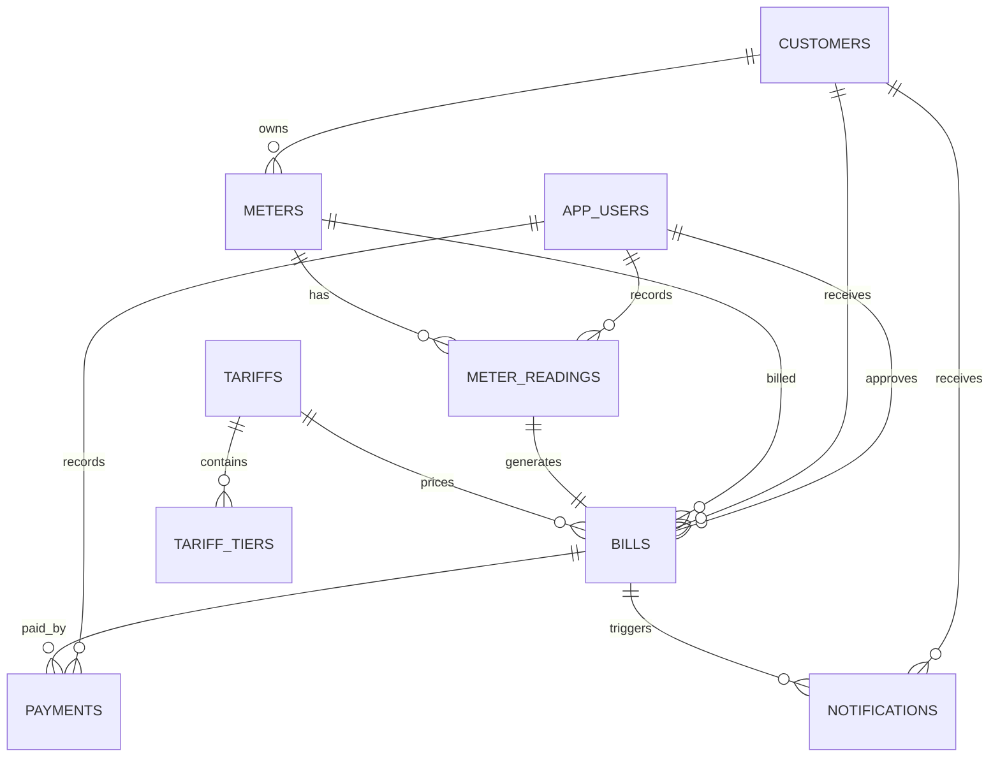
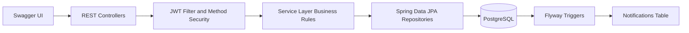

# Utility Billing System API

Spring Boot backend for a WASAC/REG-style utility billing system. It supports JWT authentication, role-based authorization, customer and meter management, readings, tariffs, bills, payments, notifications, Swagger documentation, PostgreSQL, and Flyway migrations.

## Tech Stack

Java 17, Spring Boot 3, Spring Security 6, JWT with `jjwt`, Spring Data JPA, PostgreSQL, Flyway, Lombok, MapStruct, Swagger/OpenAPI 3, and Maven.

## Seeded Admin

The required administrator is seeded and normalized at startup with BCrypt:

- Email: `jolieprincesseishimwe@gmail.com`
- Password: `Jolie@123`
- Full name: `Jolie Princesse Ishimwe`
- Phone: `+250785060644`
- Role: `ROLE_ADMIN`

The admin can upgrade users to `ROLE_OPERATOR`, `ROLE_FINANCE`, or `ROLE_CUSTOMER` through `PATCH /api/users/{id}/role`.

## Setup

Create a PostgreSQL database:

```sql
CREATE DATABASE utility_billing;
```

Configure environment variables if your database is not using the defaults:

```bash
DB_URL=jdbc:postgresql://localhost:5432/utility_billing
DB_USERNAME=postgres
DB_PASSWORD=postgres
JWT_SECRET=Zrjv9gYwM8m2z6zL0i8wZzN5rX9Y3qYhP8Y4w8r3X2I=
```

Run the application:

```bash
mvn spring-boot:run
```

Open Swagger UI:

```text
http://localhost:8080/swagger-ui.html
```

## Authentication Flow

Register a customer account with phone number, National ID, and address. The system creates an inactive user and inactive customer profile, then sends the OTP to the registered email address. After OTP verification, both the user account and customer profile become active. In Swagger, click **Authorize** after login and enter:

```text
Bearer <jwt-token>
```

Registration request example:

```json
{
  "fullName": "Test Customer",
  "email": "customer1@example.com",
  "phoneNumber": "+250788123456",
  "nationalId": "1198000000000003",
  "address": "Kigali, Nyarugenge",
  "password": "Customer@123"
}
```

## ERD

This ERD shows the relational database design used by the Flyway migrations:



## Spring Boot Flow

This flow summarizes how requests move through the backend:



## Main API Groups

- Auth: `POST /api/auth/register`, `POST /api/auth/login`, `POST /api/auth/verify-otp`, `POST /api/auth/forgot-password`, `POST /api/auth/reset-password`
- Users: `GET /api/users`, `GET /api/users/me`, `GET /api/users/{id}`, `PATCH /api/users/{id}/role`, `PATCH /api/users/{id}/role/revoke`, `DELETE /api/users/{id}`
- Customers: `GET /api/customers`, `GET /api/customers/me`, `PUT /api/customers/me`, `GET /api/customers/{id}`, `PUT /api/customers/{id}`, `PATCH /api/customers/{id}/status`
- Meters: `POST /api/meters`, `GET /api/meters`, `GET /api/meters/customer/{customerId}`, `PATCH /api/meters/{id}/status`
- Meter Readings: `POST /api/meter-readings`, `GET /api/meter-readings`, `GET /api/meter-readings/{id}`, `GET /api/meter-readings/meter/{meterId}`
- Tariffs: `POST /api/tariffs`, `GET /api/tariffs`, `GET /api/tariffs/active`, `PUT /api/tariffs/{id}`
- Bills: `POST /api/bills/generate/{meterReadingId}`, `POST /api/bills/{id}/approve`, `GET /api/bills`, `GET /api/bills/{id}`, `GET /api/bills/{id}/pdf`, `GET /api/bills/customer/{customerId}`, `GET /api/bills/reference/{reference}`
- Payments: `POST /api/payments`, `GET /api/payments`, `GET /api/payments/bill/{billId}`, `GET /api/payments/customer/{customerId}`
- Notifications: `GET /api/notifications/customer/{customerId}`, `PATCH /api/notifications/{id}/read`

## Role Summary

- `ROLE_ADMIN`: administrative endpoints, user lookup, user deletion, user role upgrades/revocations, customer activation/deactivation, tariff configuration
- `ROLE_OPERATOR`: customer/meter lookup and meter reading capture
- `ROLE_FINANCE`: bill generation/approval and payment recording
- `ROLE_CUSTOMER`: own bills, own payments, own notifications

## Business Rules Covered

- Duplicate user email, customer national ID, meter number, and transaction reference are rejected.
- Phone numbers must start with `+` and contain 10 to 12 digits.
- National IDs must contain exactly 16 digits.
- Registration sends a 6-digit OTP email, and login is blocked until the OTP is verified.
- Customer self-registration creates both an inactive user account and inactive customer profile.
- All self-registered users start as `ROLE_CUSTOMER`; admin upgrades roles when a user becomes operator or finance.
- Admin customer activation/deactivation also updates the matching user login status.
- Customers can view their own account and view/update their own customer profile.
- Role upgrades and role revocations send email notifications to the affected user.
- Customers can download their own bill as a styled PDF.
- Inactive meters cannot receive readings.
- Current reading must be greater than previous reading.
- Only one reading is allowed per meter per month/year.
- Inactive customers cannot receive bills.
- Tariffs are versioned, with new active versions deactivating old versions.
- Bills are generated from readings using flat or tiered pricing, fixed charges, and VAT.
- Payments can be partial or full and cannot exceed the outstanding balance.
- PostgreSQL triggers insert notifications when bills are approved and fully paid.
# JavaT — Spring Boot Template

A production-ready Spring Boot template with authentication, user management, email notifications, database migrations, and a clean API layer built in. Clone it, configure it, and start building your feature — not the boilerplate.

---

## Tech Stack

| Layer | Technology |
|---|---|
| Framework | Spring Boot 3.4.5 |
| Language | Java 22 |
| Security | Spring Security + JWT (jjwt 0.12.6) |
| Database | PostgreSQL |
| ORM | Spring Data JPA + Hibernate |
| Migrations | Flyway |
| Mapping | MapStruct 1.6.3 |
| Validation | Jakarta Bean Validation |
| Email | Spring Mail (JavaMailSender) |
| API Docs | SpringDoc OpenAPI (Swagger UI) |
| Utilities | Lombok |

---

## Prerequisites

- Java 22+
- Maven 3.9+
- PostgreSQL 12+

---

## Getting Started

### 1. Clone and create the database

```bash
git clone https://github.com/orestengabo0/JavaT.git
cd JavaT
```

```sql
CREATE DATABASE javat;
```

### 2. Configure credentials

`application.properties` (committed to git) contains only placeholder values. Put your real credentials in `application-local.properties` which is gitignored:

```properties
# src/main/resources/application-local.properties  ← gitignored, never committed

spring.datasource.url=jdbc:postgresql://127.0.0.1:5432/javat
spring.datasource.username=your_postgres_username
spring.datasource.password=your_postgres_password

app.jwt.secret=your-base64-encoded-secret

spring.mail.username=your-email@gmail.com
spring.mail.password=your-16-char-app-password
app.mail.from=noreply@yourdomain.com
app.mail.from-name=YourAppName
app.mail.base-url=http://localhost:8080
```

Then activate the `local` profile when running:

```bash
mvn spring-boot:run -Dspring-boot.run.profiles=local
```

Or set the environment variable in your IDE run configuration:
```
SPRING_PROFILES_ACTIVE=local
```

> **Generating a JWT secret:**
> ```bash
> openssl rand -base64 32
> ```

### 3. Run

```bash
mvn spring-boot:run
```

Flyway runs automatically on startup and creates all tables. A default admin account is seeded.

### 4. Open Swagger UI

```
http://localhost:8080/swagger-ui.html
```

---

## Default Admin Account

Seeded by Flyway migration `V2`. Use this to test admin endpoints immediately.

| Field | Value |
|---|---|
| Email | `admin@javat.com` |
| Password | *(set by your V5 migration hash)* |
| Role | `ADMIN` |

> Change this password before deploying anywhere.

---

## Project Structure

```
src/main/java/com/spring/JavaT/
├── auth/                        # Authentication & authorization
│   ├── dto/                     # Request/response DTOs
│   │   ├── RegisterRequest
│   │   ├── LoginRequest
│   │   ├── AuthResponse
│   │   ├── ForgotPasswordRequest
│   │   ├── ResetPasswordRequest
│   ├── AuthController           # Public auth endpoints
│   ├── AuthService              # Register, login, password reset, email verification
│   ├── AuthMapper               # RegisterRequest → User (MapStruct)
│   ├── PasswordResetToken       # Entity: time-limited password reset tokens
│   ├── PasswordResetTokenRepository
│   ├── EmailVerificationToken   # Entity: time-limited email verification tokens
│   └── EmailVerificationTokenRepository
│
├── user/                        # User management
│   ├── dto/
│   │   ├── UserDto              # Safe read-only projection (no password)
│   │   ├── UpdateProfileRequest
│   │   ├── UpdatePasswordRequest
│   │   └── UpdateRoleRequest
│   ├── User                     # Entity (extends BaseEntity, implements UserDetails)
│   ├── Role                     # Enum: USER, MODERATOR, ADMIN
│   ├── UserRepository           # JpaRepository + JpaSpecificationExecutor
│   ├── UserService              # Profile, password, role, deactivation
│   ├── UserController           # /api/v1/users endpoints
│   └── UserMapper               # User → UserDto (MapStruct)
│
├── common/                      # Shared infrastructure
│   ├── ApiResponse              # Standard response envelope
│   ├── ApiError                 # Single error entry
│   ├── ResponseBuilder          # Static factory for ResponseEntity
│   ├── BaseEntity               # Abstract JPA base with audit fields
│   ├── EntityStatus             # Enum: ACTIVE, INACTIVE, SUSPENDED, PENDING
│   ├── pagination/
│   │   ├── PaginationMeta       # Extracted page metadata
│   │   ├── PageResponse         # Generic paginated response
│   │   └── PaginationUtil       # Defaults, caps, sort validation
│   ├── filter/
│   │   ├── SearchCriteria       # Single filter condition (field, op, value)
│   │   └── BaseSpecification    # Generic JPA Specification builder
│   └── validation/
│       ├── ValidationMessages   # All validation message strings
│       ├── ValidationGroups     # OnCreate, OnUpdate, OnPatch, OnDelete
│       ├── ValidPassword        # Custom: password strength annotation
│       ├── ValidPasswordValidator
│       ├── NoWhitespace         # Custom: no leading/trailing spaces
│       ├── NoWhitespaceValidator
│       ├── ValidEnum            # Custom: string must match enum constant
│       └── ValidEnumValidator
│
├── security/                    # Spring Security wiring
│   ├── JwtService               # Token generation, validation, extraction
│   ├── JwtProperties            # Typed config: app.jwt.*
│   ├── JwtAuthenticationFilter  # Per-request JWT filter
│   ├── UserDetailsServiceImpl   # Loads user by email
│   ├── SecurityEntryPoint       # 401 handler → ApiResponse JSON
│   ├── AccessDeniedHandlerImpl  # 403 handler → ApiResponse JSON
│   └── SecurityProperties       # Typed config: app.security.*
│
├── notification/                # Email module
│   ├── EmailService             # Async send, verification email, password reset email
│   ├── EmailRequest             # Value object: to, subject, body, html flag
│   └── MailProperties           # Typed config: app.mail.*
│
├── config/                      # Spring configuration classes
│   ├── SecurityConfig           # SecurityFilterChain, AuthenticationManager, BCrypt
│   ├── JpaConfig                # @EnableJpaAuditing + AuditAwareImpl bean
│   ├── AsyncConfig              # @EnableAsync + email thread pool
│   └── SwaggerConfig            # OpenAPI definition + bearerAuth scheme
│
├── audit/
│   └── AuditAwareImpl           # Resolves current principal for @CreatedBy/@LastModifiedBy
│
└── exception/                   # Global exception handling
    ├── GlobalExceptionHandler   # @RestControllerAdvice — all exception → ApiResponse
    ├── BusinessException        # Base runtime exception with HttpStatus
    ├── ResourceNotFoundException # 404
    ├── DuplicateResourceException # 409
    ├── UnauthorizedException    # 401
    └── ForbiddenException       # 403

src/main/resources/
├── application.properties
├── db/migration/
│   ├── V1__create_users_table.sql
│   ├── V2__seed_admin_user.sql
│   ├── V3__create_password_reset_tokens_table.sql
│   ├── V4__create_email_verification_tokens_table.sql
│   └── V5__update_admin_password.sql
└── templates/email/
    ├── verification.html
    └── password-reset.html
```

---

## API Reference

All responses follow this envelope:

```json
{
  "success": true,
  "message": "Operation successful",
  "data": {},
  "errors": null,
  "timestamp": "2024-01-01T00:00:00Z",
  "path": "/api/v1/users"
}
```

Error responses populate `errors` instead of `data`:

```json
{
  "success": false,
  "message": "Validation failed",
  "errors": [
    { "field": "email", "message": "must be a valid email address", "code": "Email" }
  ]
}
```

### Authentication — `/api/v1/auth` (public)

| Method | Path | Description |
|---|---|---|
| `POST` | `/register` | Register a new account. Sends a verification email. Returns tokens. |
| `POST` | `/login` | Login with email + password. Returns tokens. Blocked if email unverified. |
| `GET` | `/verify-email?token=` | Verify email address from the link in the verification email. |
| `POST` | `/resend-verification` | Resend the verification email. |
| `POST` | `/forgot-password` | Request a password reset email. Always returns 200. |
| `POST` | `/reset-password` | Complete password reset using the token from email. |

**Register request:**
```json
{
  "firstName": "John",
  "lastName": "Doe",
  "username": "johndoe",
  "email": "john.doe@example.com",
  "password": "Secret@123"
}
```

**Login request:**
```json
{
  "email": "john.doe@example.com",
  "password": "Secret@123"
}
```

**Auth response:**
```json
{
  "accessToken": "eyJhbGci...",
  "refreshToken": "eyJhbGci...",
  "tokenType": "Bearer",
  "expiresIn": 86400,
  "email": "john.doe@example.com",
  "role": "USER"
}
```

### User Management — `/api/v1/users` (requires JWT)

| Method | Path | Role | Description |
|---|---|---|---|
| `GET` | `/me` | Any | Get own profile |
| `PATCH` | `/me` | Any | Update own name / username |
| `PATCH` | `/me/password` | Any | Change own password |
| `GET` | `/` | ADMIN | List all users (paginated + filtered) |
| `GET` | `/{id}` | ADMIN | Get any user by ID |
| `PATCH` | `/{id}/role` | ADMIN | Change a user's role |
| `PATCH` | `/{id}/deactivate` | ADMIN | Soft-deactivate a user |
| `PATCH` | `/{id}/activate` | ADMIN | Restore a deactivated user |

**Authenticated requests** — add the header:
```
Authorization: Bearer <accessToken>
```

**List users with filtering:**
```
GET /api/v1/users?page=0&size=10&sortBy=createdAt&sortDir=desc&role=USER&status=ACTIVE&search=gmail
```

All filter params are optional. `search` does a partial match on email.

---

## Features In Detail

### API Response Wrapper

Every endpoint returns the same JSON shape. `data` is `null` on errors; `errors` is `null` on success. Both are omitted from JSON when null (`@JsonInclude(NON_NULL)`).

Use `ResponseBuilder` in controllers:
```java
return ResponseBuilder.ok(dto, "User retrieved", request);
return ResponseBuilder.created(dto, "Account created", request);
return ResponseBuilder.noContent();
```

### JWT Authentication

- Tokens are signed with HMAC-SHA256 using a Base64-encoded secret.
- Access token default: 24 hours. Refresh token default: 7 days.
- The `sub` claim is the user's **email** (not username).
- A custom `role` claim is embedded so role checks don't require a DB lookup.
- The `JwtAuthenticationFilter` runs before every request, extracts the token, validates it, and populates `SecurityContextHolder`.

### Email Verification Flow

1. User registers → status set to `PENDING` → verification email sent async.
2. User clicks link → `GET /api/v1/auth/verify-email?token=...` → status set to `ACTIVE`.
3. Login with `PENDING` status → `403` with code `EMAIL_NOT_VERIFIED`.
4. Token expires after 24 hours → user can request a new one via `/resend-verification`.

### Password Reset Flow

1. `POST /forgot-password` → token created (15 min expiry) → email sent async.
2. `POST /reset-password` with token + new password → password updated, token marked used.
3. Always returns 200 on `/forgot-password` regardless of whether the email exists (prevents enumeration).

### Base Entity

Every entity that extends `BaseEntity` automatically gets:

| Column | Type | Description |
|---|---|---|
| `id` | `BIGINT` | Auto-generated primary key |
| `created_at` | `TIMESTAMPTZ` | Set on INSERT, never updated |
| `updated_at` | `TIMESTAMPTZ` | Updated on every UPDATE |
| `created_by` | `VARCHAR(100)` | Principal who created the record |
| `updated_by` | `VARCHAR(100)` | Principal who last modified it |
| `deleted` | `BOOLEAN` | Soft-delete flag |
| `deleted_at` | `TIMESTAMPTZ` | When it was soft-deleted |
| `deleted_by` | `VARCHAR(100)` | Who soft-deleted it |
| `status` | `VARCHAR(20)` | `ACTIVE`, `INACTIVE`, `SUSPENDED`, `PENDING` |

Soft-delete a record:
```java
entity.softDelete(currentUserEmail);
repository.save(entity);
```

Restore it:
```java
entity.restore();
repository.save(entity);
```

### Validation Layer

Custom annotations in `common/validation/`:

| Annotation | What it validates |
|---|---|
| `@ValidPassword` | 8–72 chars, upper + lower + digit + special char |
| `@NoWhitespace` | No leading or trailing spaces |
| `@ValidEnum` | String matches a given enum's constants |

All validation messages are constants in `ValidationMessages` — change once, applies everywhere.

Use `ValidationGroups` to apply different rules per operation:
```java
// Controller — only OnCreate constraints fire
@Validated(ValidationGroups.OnCreate.class) @RequestBody RegisterRequest body

// Controller — only OnPatch constraints fire
@Validated(ValidationGroups.OnPatch.class) @RequestBody UpdateProfileRequest body
```

### Pagination & Filtering

**Paginated response shape:**
```json
{
  "content": [...],
  "meta": {
    "page": 0,
    "size": 10,
    "totalElements": 47,
    "totalPages": 5,
    "first": true,
    "last": false,
    "empty": false
  }
}
```

**In a service:**
```java
Specification<User> spec = new BaseSpecification<>(criteria);
Page<User> page = userRepository.findAll(spec, pageable);
return PageResponse.of(page, userMapper::toDto);
```

**In a controller:**
```java
Pageable pageable = PaginationUtil.toPageable(page, size, sortBy, sortDir, ALLOWED_SORT_FIELDS);
```

Defaults: page=0, size=10, sortBy=id, sortDir=asc. Max size: 100.

**Adding a filter to any entity:**
1. Make the repository extend `JpaSpecificationExecutor<YourEntity>`.
2. Build a `List<SearchCriteria>` from request params.
3. Pass to `new BaseSpecification<>(criteria)`.

### Email Service

All emails are sent asynchronously on a dedicated thread pool (`emailTaskExecutor`). The calling thread returns immediately.

HTML templates live in `src/main/resources/templates/email/`. Variables use `{{placeholder}}` syntax — no template engine needed.

**Sending a custom email:**
```java
emailService.send(EmailRequest.builder()
    .to("user@example.com")
    .subject("Welcome")
    .body("<h1>Hello!</h1>")
    .html(true)
    .build());
```

**Adding a new email type:**
1. Create `templates/email/your-template.html` with `{{placeholder}}` variables.
2. Add a method to `EmailService` annotated with `@Async("emailTaskExecutor")`.
3. Call `loadTemplate("your-template.html", Map.of(...))` and pass to `send()`.

**Local development without a real mail server** — use [Mailpit](https://github.com/axllent/mailpit):
```properties
spring.mail.host=localhost
spring.mail.port=1025
spring.mail.properties.mail.smtp.auth=false
spring.mail.properties.mail.smtp.starttls.enable=false
```
Open `http://localhost:8025` to see all sent emails.

### Global Exception Handling

`GlobalExceptionHandler` catches everything and returns a consistent `ApiResponse`. You never need to write try/catch in controllers or services for these cases:

| Exception | HTTP |
|---|---|
| `MethodArgumentNotValidException` | 400 — validation errors with field details |
| `ConstraintViolationException` | 400 — path/query param violations |
| `ResourceNotFoundException` | 404 |
| `DuplicateResourceException` | 409 |
| `UnauthorizedException` | 401 |
| `ForbiddenException` | 403 |
| `DataIntegrityViolationException` | 409 — DB unique constraint (parses field name from PostgreSQL/MySQL error) |
| `TransactionSystemException` | 400 — entity-level validation at commit time |
| `AuthenticationException` | 401 |
| `AccessDeniedException` | 403 |
| `HttpMessageNotReadableException` | 400 — malformed JSON |
| `NoResourceFoundException` | 404 — unknown URL |
| `Exception` | 500 — catch-all, real cause logged server-side only |

**Throwing domain errors in services:**
```java
throw new ResourceNotFoundException("User", "id", id);
throw new DuplicateResourceException("User", "email", email);
throw new ForbiddenException("You can only modify your own resources");
throw new BusinessException("Account is suspended", HttpStatus.FORBIDDEN);
```

### Flyway Migrations

Migrations live in `src/main/resources/db/migration/` and follow the naming convention `V{version}__{description}.sql`.

| File | What it does |
|---|---|
| `V1` | Creates the `users` table |
| `V2` | Seeds the default admin user |
| `V3` | Creates `password_reset_tokens` table |
| `V4` | Creates `email_verification_tokens` table |
| `V5` | Updates admin password hash |

**Adding a new migration:**
1. Create `V6__your_description.sql` in `db/migration/`.
2. Write your SQL.
3. Restart the app — Flyway runs it automatically.

> Never modify an existing migration file after it has been applied. Flyway checksums every file and will refuse to start if a checksum changes.

### Role-Based Access Control

Three roles: `USER`, `MODERATOR`, `ADMIN`.

**Coarse-grained** — on controller methods:
```java
@PreAuthorize("hasRole('ADMIN')")
@GetMapping
public ResponseEntity<?> listAll(...) { ... }
```

**Fine-grained** — inside service methods:
```java
if (!currentUser.getId().equals(resourceOwnerId)) {
    throw new ForbiddenException("You can only modify your own resources");
}
```

`@EnableMethodSecurity` is active in `SecurityConfig`, so `@PreAuthorize` works on any Spring-managed bean.

---

## Configuration Reference

All custom properties are prefixed with `app.*`:

```properties
# JWT
app.jwt.secret=                          # Base64-encoded HMAC-SHA256 key (min 32 bytes)
app.jwt.expiration-ms=86400000           # Access token TTL in ms (default: 24h)
app.jwt.refresh-expiration-ms=604800000  # Refresh token TTL in ms (default: 7d)
app.jwt.issuer=JavaT                     # JWT iss claim

# Security
app.security.public-paths[0]=/api/v1/auth/**   # Paths that bypass JWT

# Mail
app.mail.from=noreply@yourdomain.com
app.mail.from-name=YourAppName
app.mail.base-url=http://localhost:8080  # Used to build links in emails

# Async thread pool
app.async.core-pool-size=2
app.async.max-pool-size=5
app.async.queue-capacity=100
app.async.thread-name-prefix=async-email-

# Token expiry
app.auth.password-reset-token-expiry-minutes=15
app.auth.verification-token-expiry-hours=24
```

---

## Using This Template for a New Project

1. Clone the repository.
2. Rename the package from `com.spring.JavaT` to `com.yourcompany.yourapp` (IDE refactor → rename package).
3. Update `spring.application.name` in `application.properties`.
4. Update `pom.xml` `<groupId>`, `<artifactId>`, and `<name>`.
5. Create your database and update the datasource credentials.
6. Generate a new JWT secret: `openssl rand -base64 32`.
7. Configure your SMTP credentials.
8. Run `mvn spring-boot:run` — Flyway creates the schema automatically.
9. Start building your domain features on top.

---

## Extending the Template

### Adding a new entity

```java
@Entity
@Table(name = "products")
public class Product extends BaseEntity {
    // Your fields — id, timestamps, audit, soft-delete, status come from BaseEntity
    private String name;
    private BigDecimal price;
}
```

### Adding a new paginated + filtered endpoint

```java
// Repository
public interface ProductRepository extends JpaRepository<Product, Long>,
        JpaSpecificationExecutor<Product> { }

// Service
public PageResponse<ProductDto> findAll(List<SearchCriteria> criteria, Pageable pageable) {
    Specification<Product> spec = new BaseSpecification<>(criteria);
    return PageResponse.of(productRepository.findAll(spec, pageable), productMapper::toDto);
}

// Controller
@GetMapping
public ResponseEntity<ApiResponse<PageResponse<ProductDto>>> list(
        @RequestParam(required = false) Integer page,
        @RequestParam(required = false) Integer size,
        @RequestParam(required = false) String sortBy,
        @RequestParam(required = false) String sortDir,
        @RequestParam(required = false) String name,
        HttpServletRequest request) {

    Pageable pageable = PaginationUtil.toPageable(page, size, sortBy, sortDir,
            Set.of("id", "name", "price", "createdAt"));

    List<SearchCriteria> criteria = new ArrayList<>();
    if (name != null) criteria.add(new SearchCriteria("name", SearchCriteria.Op.LIKE, name));

    return ResponseBuilder.ok(
            productService.findAll(criteria, pageable),
            "Products retrieved successfully",
            request);
}
```

### Adding a new email type

```java
// 1. Create templates/email/welcome.html with {{firstName}}, {{appName}} placeholders

// 2. Add to EmailService
@Async("emailTaskExecutor")
public void sendWelcomeEmail(String toEmail, String firstName) {
    String body = loadTemplate("welcome.html", Map.of(
            "appName",   mailProperties.getFromName(),
            "firstName", firstName
    ));
    send(EmailRequest.builder()
            .to(toEmail)
            .subject("Welcome to " + mailProperties.getFromName())
            .body(body)
            .html(true)
            .build());
}
```

---

## License

MIT — use freely for personal and commercial projects.
